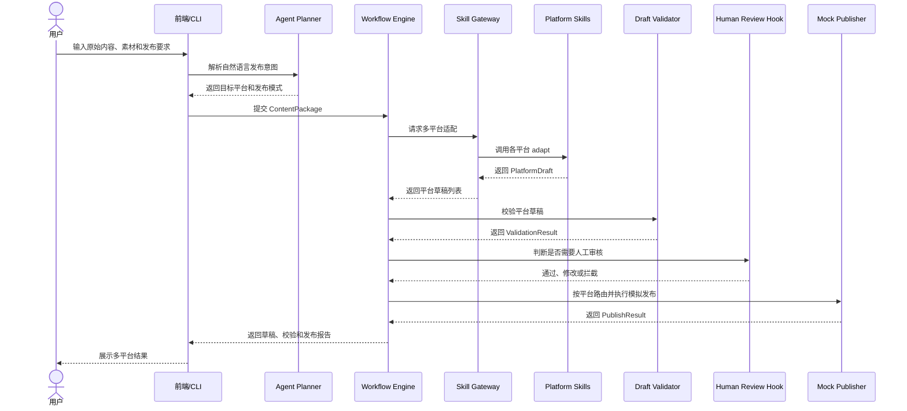
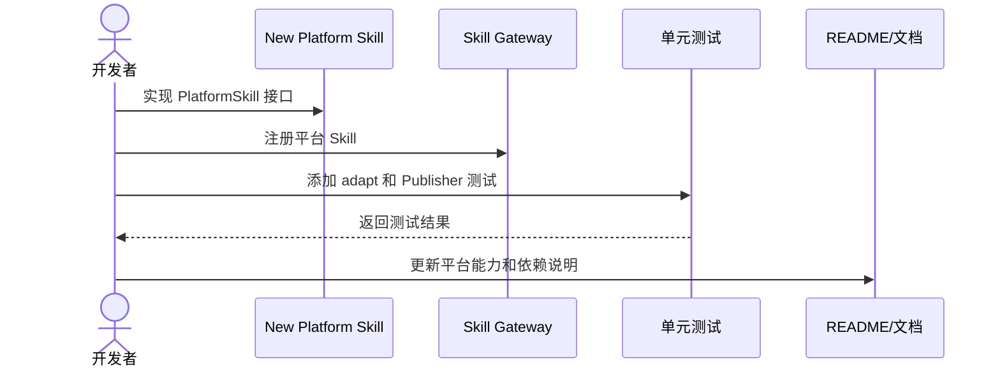

# 顺序图

## 多平台内容发布流程

```mermaid
sequenceDiagram
    actor User as 用户
    participant UI as 前端/CLI
    participant Planner as Agent Planner
    participant Workflow as Workflow Engine
    participant Gateway as Skill Gateway
    participant Skill as Platform Skills
    participant Validator as Draft Validator
    participant Review as Human Review Hook
    participant Publisher as Mock Publisher

    User->>UI: 输入原始内容、素材和发布要求
    UI->>Planner: 解析自然语言发布意图
    Planner-->>UI: 返回目标平台和发布模式
    UI->>Workflow: 提交 ContentPackage
    Workflow->>Gateway: 请求多平台适配
    Gateway->>Skill: 调用各平台 adapt
    Skill-->>Gateway: 返回 PlatformDraft
    Gateway-->>Workflow: 返回平台草稿列表
    Workflow->>Validator: 校验平台草稿
    Validator-->>Workflow: 返回 ValidationResult
    Workflow->>Review: 判断是否需要人工审核
    Review-->>Workflow: 通过、修改或拦截
    Workflow->>Publisher: 按平台路由并执行模拟发布
    Publisher-->>Workflow: 返回 PublishResult
    Workflow-->>UI: 返回草稿、校验和发布报告
    UI-->>User: 展示多平台结果
```

## 新增平台 Skill 流程

```mermaid
sequenceDiagram
    actor Dev as 开发者
    participant Skill as New Platform Skill
    participant Gateway as Skill Gateway
    participant Test as 单元测试
    participant Docs as README/文档

    Dev->>Skill: 实现 PlatformSkill 接口
    Dev->>Gateway: 注册平台 Skill
    Dev->>Test: 添加 adapt 和 Publisher 测试
    Test-->>Dev: 返回测试结果
    Dev->>Docs: 更新平台能力和依赖说明
```
