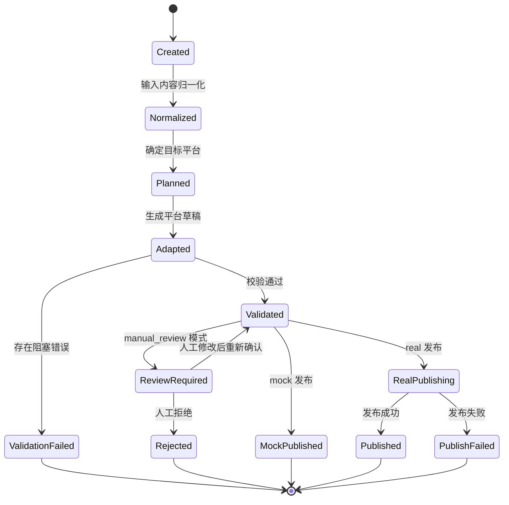
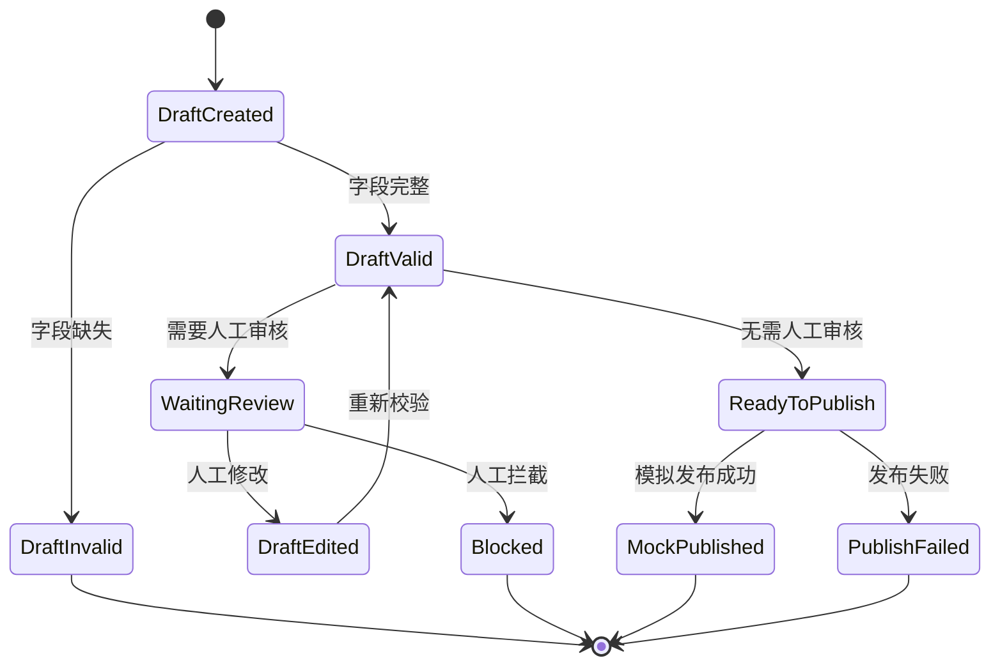

# 状态图

## 发布任务状态

```mermaid
stateDiagram-v2
    [*] --> Created
    Created --> Normalized: 输入内容归一化
    Normalized --> Planned: 确定目标平台
    Planned --> Adapted: 生成平台草稿
    Adapted --> ValidationFailed: 存在阻塞错误
    Adapted --> Validated: 校验通过
    Validated --> ReviewRequired: manual_review 模式
    ReviewRequired --> Rejected: 人工拒绝
    ReviewRequired --> Validated: 人工修改后重新确认
    Validated --> MockPublished: mock 发布
    Validated --> RealPublishing: real 发布
    RealPublishing --> Published: 发布成功
    RealPublishing --> PublishFailed: 发布失败
    ValidationFailed --> [*]
    Rejected --> [*]
    MockPublished --> [*]
    Published --> [*]
    PublishFailed --> [*]
```

## 平台草稿状态

```mermaid
stateDiagram-v2
    [*] --> DraftCreated
    DraftCreated --> DraftValid: 字段完整
    DraftCreated --> DraftInvalid: 字段缺失
    DraftValid --> WaitingReview: 需要人工审核
    WaitingReview --> DraftEdited: 人工修改
    DraftEdited --> DraftValid: 重新校验
    WaitingReview --> Blocked: 人工拦截
    DraftValid --> ReadyToPublish: 无需人工审核
    ReadyToPublish --> MockPublished: 模拟发布成功
    ReadyToPublish --> PublishFailed: 发布失败
    DraftInvalid --> [*]
    Blocked --> [*]
    MockPublished --> [*]
    PublishFailed --> [*]
```

